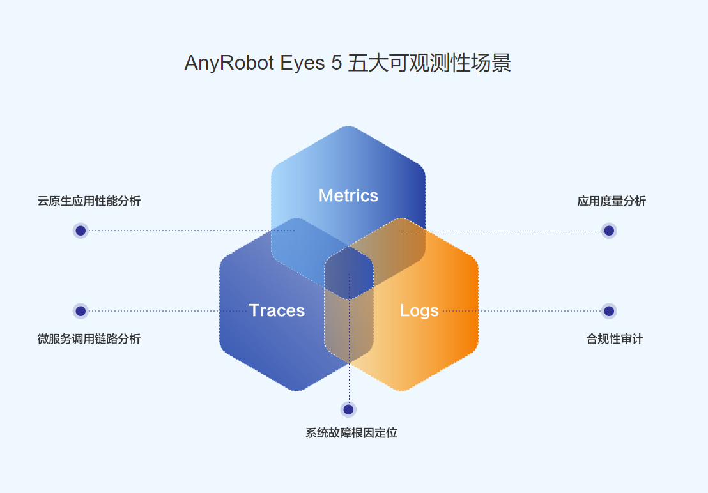

[中文版](README.md)

# 

# [TelemetrySDK-Go Trace](https://devops.aishu.cn/AISHUDevOps/ONE-Architecture/_git/TelemetrySDK-Go?version=GBfeature-arp-205194&path=/exporters/artrace/README.md&_a=preview)

`TelemetrySDK-Go` is the [Go](https://golang.org/) version implementation of [OpenTelemetry](https://opentelemetry.io/).
This project provides a series of interfaces to help developers complete the code embedding process,
aiming to improve the observability of developers' business system.

`Trace` improves the visibility of our system and lets us debug behavior that is difficult to reproduce locally.
This document aims to introduce the related concepts of Distributed Trace and guide how to use `TelemetrySDK-Go Trace`
to produce trace in your system written in Go language and report trace data to AnyRobot to build the observability.

### Compatibility

TelemetrySDK-Go requires your Go version not less than `1.18`。

### [Glossary](docs/cn/glossary.md)

### [Dev Guide](docs/cn/dev_guide.md)

### [Interface](docs/cn/interface.md)

### [Examples](examples/oneservice.go)

### Best Practices