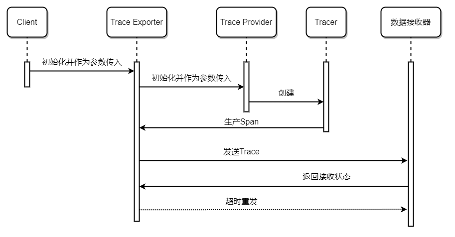

# [术语表](https://confluence.aishu.cn/pages/viewpage.action?pageId=160886185)
## [缩写表](https://opentelemetry.io/docs/concepts/observability-primer/#what-is-observability)：
|     缩写      |         全称          | 原文                                                                                                                                                                                                                                                                                                                                                                                                                                                                                                                                                                                                                                                                                                                                                                                                                                                                                             | 翻译                                                                                                      |
|:-----------:|:-------------------:|:-----------------------------------------------------------------------------------------------------------------------------------------------------------------------------------------------------------------------------------------------------------------------------------------------------------------------------------------------------------------------------------------------------------------------------------------------------------------------------------------------------------------------------------------------------------------------------------------------------------------------------------------------------------------------------------------------------------------------------------------------------------------------------------------------------------------------------------------------------------------------------------------------|:--------------------------------------------------------------------------------------------------------|
|             |  **Observability**  | Observability lets us understand a system from the outside, by letting us ask questions about that system without knowing its inner workings. Furthermore, allows us to easily troubleshoot and handle novel problems (i.e. “unknown unknowns”), and helps us answer the question, “Why is this happening?”                                                                                                                                                                                                                                                                                                                                                                                                                                                                                                                                                                                    | 可观测性让我们可以从外部观测到原本未知的系统内部工作情况。                                                                           |
|  **OTel**   |    OpenTelemetry    | OpenTelemetry, also known as OTel for short, is a vendor-neutral open-source Observability framework for instrumenting, generating, collecting, and exporting telemetry data such as traces, metrics, logs. OpenTelemetry is the mechanism by which application code is instrumented, to help make a system observable.                                                                                                                                                                                                                                                                                                                                                                                                                                                                                                                                                                        | OTel是一个开源的可观测性框架，通过收集Traces, Metrics, Logs来使得系统可观测。                                                     |
|             |    **Telemetry**    | Telemetry refers to data emitted from a system, about its behavior. The data can come in the form of Traces, Metrics, and Logs.                                                                                                                                                                                                                                                                                                                                                                                                                                                                                                                                                                                                                                                                                                                                                                | Telemetry是指从系统中发送Traces, Metrics, Logs来测量系统的表现。                                                         |
|  **Trace**  |  Distributed Trace  | A Distributed Trace, more commonly known as a Trace, records the paths taken by requests (made by an application or end-user) as they propagate through multi-service architectures, like microservice and serverless applications. It improves the visibility of our application or system’s health and lets us debug behavior that is difficult to reproduce locally. Tracing is essential for distributed systems, which commonly have nondeterministic problems or are too complicated to reproduce locally. Traces give us the big picture of what happens when a request is made by user or an application. A Trace is made of one or more Spans. The first Span represents the Root Span. Each Root Span represents a request from start to finish. The Spans underneath the parent provide a more in-depth context of what occurs during a request (or what steps make up a request).  | Trace记录了请求在微服务应用中的传播路径，它增强了系统的可观测性和服务运行健康程度的可见性。Trace能帮助我们了解从用户发送请求到服务端响应结果，系统做了哪些事情。一条Trace由多个Span组成。  |
|             |      **Span**       | A Span represents a unit of work or operation. It tracks specific operations that a request makes, painting a picture of what happened during the time in which that operation was executed. A Span contains name, time-related data, structured log messages, and other metadata (i.e. Attributes) to provide information about the operation it tracks.                                                                                                                                                                                                                                                                                                                                                                                                                                                                                                                                      | Span是链路当中的最小操作单元，它记录了一次完整的请求。Span的数据结构参考下方的表格。                                                          |
|             |     **Baggage**     | Baggage refers to contextual information that’s passed between spans.                                                                                                                                                                                                                                                                                                                                                                                                                                                                                                                                                                                                                                                                                                                                                                                                                          | Baggage是跨服务传递的上下文信息。                                                                                    |
|             |       **Log**       | A Log is a timestamped text record, either structured (recommended) or unstructured, with metadata. Unlike Traces, however, they are not necessarily associated with any particular user request or transaction. They are found almost everywhere in software, and have been heavily relied on in the past by both developers and operators alike to help them understand system behavior. Unfortunately, logs aren’t extremely useful for tracking code execution, as they typically lack contextual information, such as where they were called from. They become far more useful when they are included as part of a Span.                                                                                                                                                                                                                                                                  | Log是带有时间戳的结构化的文本，不需要和特定的用户请求或者事务绑定，这也意味着它缺乏上下文信息，对于链路追踪来说不是很有用。要想让Log变得有用，需要规范Log格式，最好成为Span的一部分。       |
|             |     **Metric**      | Metrics are aggregations over a period of time of numeric data about your infrastructure or application. Examples include: system error rate, CPU utilization, request rate for a given service. A metric is a measurement about a service, captured at runtime.                                                                                                                                                                                                                                                                                                                                                                                                                                                                                                                                                                                                                               | Metric是系统的指标数据，包括但不限于系统错误率、CPU利用率、服务的请求率。Metric是系统运行过程中的各项指标度量。                                         |

## [OpenTelemetry中生产Trace的流程](https://opentelemetry.io/docs/concepts/signals/traces/#tracer-provider)：

|         概念          | 原文                                                                                                                                                                                                                                                                                                                                                                                                                  | 翻译                                                                                                                     |
|:-------------------:|:--------------------------------------------------------------------------------------------------------------------------------------------------------------------------------------------------------------------------------------------------------------------------------------------------------------------------------------------------------------------------------------------------------------------|:-----------------------------------------------------------------------------------------------------------------------|
|     **Tracer**      | A Tracer creates spans containing more information about what is happening for a given operation, such as a request in a service. Tracers are created from Tracer Providers. In some languages, a global Tracer is already initialized for you.                                                                                                                                                                     | Tracer是由Tracer Provider创建的一个全局变量，用来生产Span。                                                                             |
| **Tracer Provider** | A Tracer Provider is a factory for Tracers. In most applications, a Tracer Provider is initialized once and its lifecycle matches the application’s lifecycle. Tracer Provider initialization also includes Resource and Exporter initialization. It is typically the first step in tracing with OpenTelemetry. In some language SDKs, a global Tracer Provider is already initialized for you.                     | Tracer Provider是创建Tracer的工厂。Tracer Provider在服务中只会初始化一次，生命周期和服务的生命周期相同。Tracer Provider在初始化的时候要带上两个参数：Exporter和Resource。 |
| **Trace Exporter**  | Trace Exporters send traces to a consumer. This consumer can be standard output for debugging and development-time, the OpenTelemetry Collector, or any open-source or vendor backend of your choice.                                                                                                                                                                                                               | Trace Exporter把生产的Span发送到Trace接收器。既可以发送到本地文件用来调试，也可以发送到链路分析端例如AnyRobot。                                                |
|  **Trace Context**  | Trace Context is metadata about trace spans that provides correlation between spans across service and process boundaries. For example, let’s say that Service A calls Service B and you want to track the call in a trace. In that case, OpenTelemetry will use Trace Context to capture the ID of the trace and current span from Service A, so that spans created in Service B can connect and add to the trace. | Trace Context是可以跨越分布式服务传递的分布式上下文信息。                                                                                    |

## [Span的数据格式](https://opentelemetry.io/docs/concepts/signals/traces/#span-context)：

|          **字段**          | **类型** | **是否必填** | **主动设置** | **自动生成** | **说明**                                                                                           |
|:------------------------:|:------:|:--------:|:--------:|:--------:|:-------------------------------------------------------------------------------------------------|
|         **Name**         | string |    ✓     |    ✓     |          | Span名称，记录响应请求的函数的名字。                                                                             |
|     **SpanContext**      | object |    ✓     |          |    ✓     | 唯一且不可变对象，必须能够序列化，并沿着分布式上下文传递。内部字段参考下表。                                                           |
|        **Parent**        | object |    ✓     |          |    ✓     | 父Span的SpanContext，仅根节点的Parent为空。                                                                 |
|       **SpanKind**       |  int   |    ✓     |    ✓     |    ✓     | 记录了Span所属服务的类型，并且指定了Span的父子关系。为5种类型之一：INTERNAL、SERVER、CLIENT、PRODUCER、CONSUMER。                  |
|      **StartTime**       | string |    ✓     |          |    ✓     | Span开始时间，时间格式为RFC3339。                                                                           |
|       **EndTime**        | string |    ✓     |          |    ✓     | Span结束时间，时间格式为RFC3339。                                                                           |
|      **Attributes**      | array  |    ✓     |    ✓     |          | 和业务相关的键值对。键和值都必须非空且有语义，数值只有8种类型：STRING、BOOL、INT、FLOAT、STRINGARRAY、BOOLARRAY、INTARRAY、FLOATARRAY。 |
|        **Links**         | array  |    ✓     |    ✓     |          | 关联异步操作的父Span的SpanContext。                                                                        |
|        **Events**        | array  |    ✓     |    ✓     |          | 记录Span某一时间点发生的有意义的事件。                                                                            |
|        **Status**        | object |    ✓     |    ✓     |    ✓     | 记录Span的状态，可用于染色采样，Code只有3种类型：Unset、Error、Ok，Description仅当Code=Error时有效。                          |
| **InstrumentationScope** | object |    ✕     |          |    ✓     | 记录使用的TelemetrySDK名称、版本、地址                                                                        |
|       **Resource**       | array  |    ✓     |    ✓     |    ✓     | 记录当前Span所处业务的服务名、版本，需要客户填写。记录TelemetrySDK名称、版本、语言，自动填充。                                          |
|  **DroppedAttributes**   |  int   |    ✕     |          |    ✓     | 采样后丢弃的Attributes的数量                                                                              |
|    **DroppedEvents**     |  int   |    ✕     |          |    ✓     | 采样后丢弃的Events的数量                                                                                  |
|     **DroppedLinks**     |  int   |    ✕     |          |    ✓     | 采样后丢弃的Links数量                                                                                    |
|    **ChildSpanCount**    |  int   |    ✕     |          |    ✓     | 当前Span子span的个数                                                                                   |

## SpanContext与Parent字段内属性：

|     **字段**     | **类型** | **是否必填** | **主动设置** | **自动生成** | **说明**                                                                                                      |
|:--------------:|:------:|:--------:|:--------:|:--------:|:------------------------------------------------------------------------------------------------------------|
|  **TraceID**   | string |    ✓     |          |    ✓     | 一个有效的TraceID是一个16字节的数组\[16\]byte，且至少有一个非0字节。输出为字符串类型时会转成32长度的字符串。                                           |
|   **SpanID**   | string |    ✓     |          |    ✓     | 一个有效的SpanID是一个8字节的数组\[8\]byte，且至少有一个非0字节。输出为字符串类型时会转成16长度的字符串。                                              |
| **TraceFlags** | string |    ✓     |          |    ✓     | 是否采样标记位，总共8个标记位，用16进制符号00~ff记录：00表示全采样。                                                                     |
| **TraceState** | string |    ✓     |          |    ✓     | TraceState记录服务间使用的不同Trace供应商，比如tracestate: rojo=00f067aa0ba902b7,congo=t61rcWkgMzE，表示有rojo和congo两个trace供应商。 |
|   **Remote**   |  bool  |    ✕     |          |    ✓     | 是否跨源传递，如果Span具有远程父对象，Remote=true，默认值为false。                                                                 |

## [SpanKind字段的枚举值描述](https://opentelemetry.io/docs/concepts/signals/traces/#span-kind)：

|  **跨度种类**   | **同步** | **异步** | **远端接收** | **远端发送** | **使用的数字标记** | **描述**                                               |
|:-----------:|:------:|:------:|:--------:|:--------:|:-----------:|:-----------------------------------------------------|
| UNSPECIFIED |        |        |          |          |      0      | 未指定Span所属服务的类型，是非预期的类型。                              |
|  INTERNAL   |        |        |          |          |      1      | 默认值，表示Span所属服务的类型是内部类型，不具有远程父对象或子对象的操作。              |
|   SERVER    |   ✓    |        |    ✓     |          |      2      | 表示Span所属服务的类型是同步处理的远程服务类型，属于父子关系中的子，在操作完成后响应给CLIENT。 |
|   CLIENT    |   ✓    |        |          |    ✓     |      3      | 表示Span所属服务的类型是同步处理的远程请求类型，属于父子关系中的父，等待SERVER响应操作。    |
|  PRODUCER   |        |   ✓    |          |    ✓     |      4      | 表示Span所属服务的类型是异步处理的生产者类型，属于父子关系中的父。                  |
|  CONSUMER   |        |   ✓    |    ✓     |          |      5      | 表示Span所属服务的类型是异步处理的消费者类型，属于父子关系中的子。                  |

## Resource记录信息定义：

|           **字段**           | **类型** | **是否必填** | **主动设置** | **自动生成** | **说明**   | **示例**                               |
|:--------------------------:|:------:|:--------:|:--------:|:--------:|:---------|:-------------------------------------|
|       **host.arch**	       | string |    ✕     |          |    ✓     | 主机CPU架构  | amd64、arm64                          |
|        **host.ip**	        | string |    ✕     |          |    ✓     | 主机IP地址   | 1.2.3.4                              |
|       **host.name**	       | string |    ✕     |          |    ✓     | 主机名称     | Desk-028                             |
|        **host.id**	        | string |    ✕     |          |    ✓     | 主机UUID   | edfd25ff-3c9c-b1a4-e660-bd826495ad35 |
|        **os.name**	        | string |    ✕     |          |    ✓     | 操作系统类型   | windows、linux                        |
|      **os.version**	       | string |    ✕     |          |    ✓     | 操作系统版本   | CentOS 7.7                           |
|     **os.description**     | string |    ✕     |          |    ✓     | 操作系统详细信息 | Microsoft Windows 10 Enterprise      |
|  **service.instance.id**   | string |    ✕     |          |          | 服务实例的ID  | 627cc493-f310-47de-96bd-71410b7dec09 |
|      **service.name**      | string |    ✓     |    ✓     |          | 服务名称     | ShoppingMart                         |
|    **service.version**     | string |    ✓     |    ✓     |          | 服务的版本号   | 5.3.0                                |
| **telemetry.sdk.language** | string |    ✓     |          |    ✓     | SDK的开发语言 | go                                   |
|   **telemetry.sdk.name**   | string |    ✓     |          |    ✓     | SDK名称    | TelemetrySDK-Go/exporters/artrace    |
| **telemetry.sdk.version**  | string |    ✓     |          |    ✓     | SDK版本号   | v2.2.0                               |

