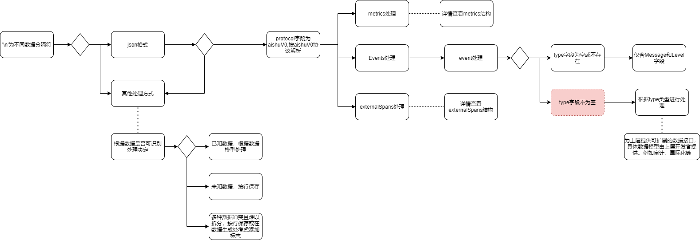
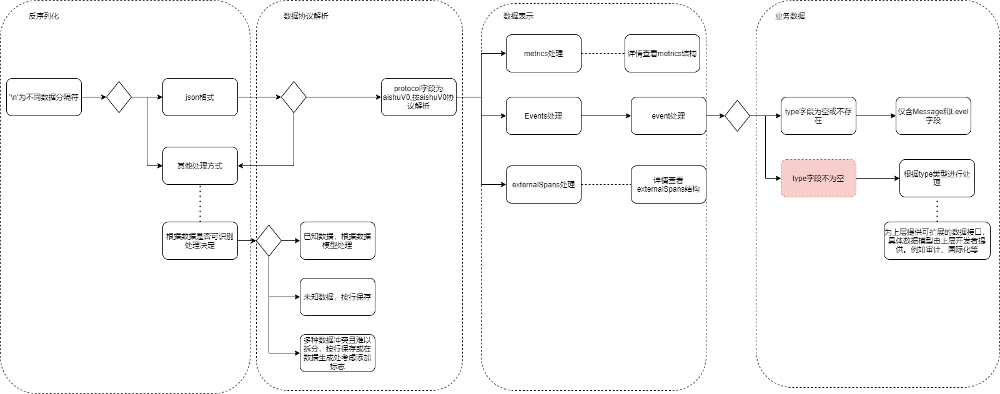

# 数据分层介绍

当前实现数据模型分层如下图




# 数据模型结构定义


## AishuV0协议

序列化层为'\n'分隔的json文本。每个`InternalSpan`为一次日志输出，内部包含指标、日志事件和外部调用追踪。多个`InternalSpan`聚合可以用于进行内部调用追踪/线程追踪。各个字段如下表所述

## InternalSpan 结构定义

一个InternalSpan代表一个内部调用产生的线程，通过InternalSpan记录数据保证数据上下文的连续性。

| 字段名             | 类型                | 描述                                                         |
| :----------------- | :------------------ | :----------------------------------------------------------- |
| Version            | string              | 表示数据内容协议版本，AISHUV0                                |
| TraceId            | string              | 分布式事务ID，一个trace含有多个span                          |
| SpanId             | string              | 子分布式事务ID，多个span组成trace。span间的父子关系和兄弟关系可以描述一次事务的内外调用关系 |
| Timestamp          | unixTime            | span开始时间                                                 |
| EndTime            | unixTime            | span结束时间                                                 |
| Body.Events        | Event(Array)        | 数据事件数组，一个event一般代表线程内的一次日志记录行为。events可以组成线程内的日志上下文。详细结构定义见下面的「Event 结构定义」 |
| Body.Metrics       | Metric(Array)       | 指标数组。代表一次线程执行的指标数据详细结构定义见下面的「Metric 结构定义」 |
| Body.ExternalSpans | ExternalSpan(Array) | 外部调用追踪数组，表示当前线程发起的多次外部调用             |
| Attributes         | **Attributes**      | 一次内部调用的业务属性，会继承父内部调用的业务属性。与body的区别在于body更倾向于系统内部具体描述，Attributes倾向于对本次事务的描述。 |
| Resources          | Resources           | 系统进程属性，与Attributes区别在于attributes更倾向于业务信息，resource关注系统或进程上下文 |

## Event 结构定义

所有类型的Event应该通过流程严格管理，确保全局唯一

| 字段名         | 类型         | 描述                                                         |
| :------------- | :----------- | :----------------------------------------------------------- |
| SeverityNumber | Int          | 日志级别，Trace->Fatal对应值为1->6                           |
| SeverityText   | string       | 日志级别，字符串格式                                         |
| type           | string       | event类型，默认为空，非空值时由应用定义用于扩展数据类型      |
| message        | string或任意 | type为空时为字符串，type非空时由上层应用定义，由对应定义者提供数据模型 |

## Metric 结构定义

| 字段名     | 类型              | 描述                                                      |
| :--------- | :---------------- | :-------------------------------------------------------- |
| Attributes | map[string]string | 指标属性，为map类型，key值类型为字符串、value同样为字符串 |
| Labels     | string(array)     | 标签数组，数组内元素为数组                                |
| 其他字段   | string            | key值为metric名称，value值为metric值                      |

## Attributes 结构定义

所有类型的Attributes应该通过流程严格管理，确保全局唯一

| 字段名     | 类型   | 描述                                                         |
| :--------- | :----- | :----------------------------------------------------------- |
| Type       | string | 指明该Attributes的类型，该类型应该全局唯一，不可重复，避免数据冲突 |
| Attributes | 任意   | 其他字段提供给使用者定义属性信息                             |


## Resource 结构定义

| 字段名                 | 类型   | 描述        |
| :--------------------- | :----- | :---------- |
| Hostname               | string | 节点主机名  |
| telemetry.sdk.name     | string | sdk名称     |
| telemetry.sdk.version  | string | sdk版本号   |
| telemetry.sdk.language | string | sdk开发语言 |
| 其他                   | string | 待定        |

## 数据样例

以下数据为无外部干扰的理想数据，每个InternalSpan中含有一些ExternalSpan外部调用、metric以及应用业务事件日志。为方便介绍，日志为美观输出，真实输出仅为一行

```
{`` ``"Version"``: ``"AISHUV0"``,`` ``"TraceId"``: ``"02278ca70000100000000000000000050000000000000000"``,`` ``"SpanId"``: ``"02278bc60000100000000000000000040000000000000000"``,`` ``"ParentId"``: ``"02278d280000100000000000000000060000000000000000"``,`` ``"StartTime"``: ``1621318003``,`` ``"EndTime"``: ``1621318003``,`` ``"Body"``: {``  ``"Events"``: [``   ``{``    ``"SeverityText"``: ``"Debug"``,``    ``"message"``: ``"debug string message"``,``    ``"timestamp"``: ``1621318003``   ``},``   ``{``    ``"SeverityText"``: ``"Debug"``,``    ``"message"``: ``"debug field message"``,``    ``"timestamp"``: ``1621318003``,``    ``"type"``: ``"test"``   ``}``  ``],``  ``"Metrics"``: [``   ``{``    ``"root thread"``: ``0``,``    ``"Attributes"``: {``     ``"root"``: ``"root span"``    ``},``    ``"Labels"``: [``     ``"root"``,``     ``"metric"``    ``]``   ``}``  ``],``  ``"ExternalSpans"``: [``   ``{``    ``"TraceId"``: ``"02278ca70000100000000000000000050000000000000000"``,``    ``"ParentId"``: ``"02278d280000100000000000000000060000000000000000"``,``    ``"InternalParentId"``: ``"02278bc60000100000000000000000040000000000000000"``,``    ``"SpanId"``: ``"0227bc5100001000000000000000000a0000000000000000"``,``    ``"StartTime"``: ``1621318003``,``    ``"EndTime"``: ``1621318003``,``    ``"Attributes"``: {``     ``"method"``: ``"test"``,``     ``"host"``: ``"test"``,``     ``"attr0"``: ``"02278ca70000100000000000000000050000000000000000"``,``     ``"attr1"``: ``"02278d280000100000000000000000060000000000000000"``,``     ``"attr2"``: ``"02278d280000100000000000000000060000000000000000"``,``     ``"attr3"``: ``"0227bc5100001000000000000000000a0000000000000000"``    ``}``   ``}``  ``]`` ``},`` ``"Attributes"``: {``  ``"type"``: ``"SampleLogerTest"``,``  ``"Attributes"``: {``   ``"work"``: ``"test"``,``   ``"testFunc"``: ``"TestSamplerLogger"``,``   ``"testSpan"``: ``"root"``  ``}`` ``},`` ``"Resource"``: {``  ``"HOSTNAME"``: ``"localhost.localdomain"``,``  ``"telemetry.sdk.name"``: ``"Aishu custom opentelemetry"``,``  ``"telemetry.sdk.version"``: ``"1.0.0"``,``  ``"telemetry.sdk.language"``: ``"go"`` ``}``}
```

Standalone Log

```
{`` ``"Version"``: ``"AISHUV0"``,`` ``"TraceId"``: ``"02278ca70000100000000000000000050000000000000000"``,`` ``"SpanId"``: ``"0227b1a10000100000000000000000090000000000000000"``,`` ``"ParentId"``: ``"02278bc60000100000000000000000040000000000000000"``,`` ``"StartTime"``: ``1621318003``,`` ``"EndTime"``: ``1621318003``,`` ``"Body"``: {``  ``"Events"``: [``   ``{``    ``"SeverityText"``: ``"Debug"``,``    ``"message"``: ``"debug string"``,``    ``"timestamp"``: ``1621318003``   ``}``  ``],``  ``"Metrics"``: [],``  ``"ExternalSpans"``: []`` ``},`` ``"Attributes"``: {``  ``"type"``: ``"SampleLogerTest"``,``  ``"Attributes"``: {``   ``"work"``: ``"test"``,``   ``"testFunc"``: ``"TestSamplerLogger"``,``   ``"testSpan"``: ``"root"``  ``}`` ``},`` ``"Resource"``: {``  ``"HOSTNAME"``: ``"localhost.localdomain"``,``  ``"telemetry.sdk.name"``: ``"Aishu custom opentelemetry"``,``  ``"telemetry.sdk.version"``: ``"1.0.0"``,``  ``"telemetry.sdk.language"``: ``"go"`` ``}``}
```

### 真实标准输出数据

在使用第三方库时，由于第三方库日志存在输出到标准输出的情况，因此真实日志数据中会存在脏数据，真实数据如下，处理方式查看第一节数据分层。

```
{``"TraceId"``: ``"1743fb330000100000000000000000300000000000000000"``,``"SpanId"``: ``"1743fa0000001000000000000000002f0000000000000000"``,``"ParentId"``: ``"1743fbb70000100000000000000000310000000000000000"``,``"StartTime"``: ``1620807308``,``"EndTime"``: ``1620807308``,``"Events"``: [{``"SeverityNumber"``: ``"Debug"``,``"message"``: ``"debug string message"``},{``"SeverityNumber"``: ``"Debug"``,``"message"``: ``"debug field message"``}],``"metrics"``: [{``"root thread"``: ``0``,``"Attributes"``: {``"root"``: ``"root span"``},``"Labels"``: [``"root"``,``"metric"``]}],``"externalSpans"``: [{``"TraceId"``: ``""``,``"ParentId"``: ``""``,``"InternalParentId"``: ``"17410dc600001000000000000000002d0000000000000000"``,``"SpanId"``: ``"1742fdc800001000000000000000002e0000000000000000"``,``"StartTime"``: -``62135596800``,``"EndTime"``: -``62135596800``,``"Attributes"``: {}},{``"TraceId"``: ``"1743fb330000100000000000000000300000000000000000"``,``"ParentId"``: ``"1743fbb70000100000000000000000310000000000000000"``,``"InternalParentId"``: ``"1743fa0000001000000000000000002f0000000000000000"``,``"SpanId"``: ``"17440a420000100000000000000000330000000000000000"``,``"StartTime"``: ``1620807308``,``"EndTime"``: ``1620807308``,``"Attributes"``: {``"method"``: ``"test"``,``"host"``: ``"test"``,``"attr0"``: ``"1743fb330000100000000000000000300000000000000000"``,``"attr1"``: ``"1743fbb70000100000000000000000310000000000000000"``,``"attr2"``: ``"1743fbb70000100000000000000000310000000000000000"``,``"attr3"``: ``"17440a420000100000000000000000330000000000000000"``}}]}````I Am Faker. ahhhhhhhhhhhhhhhhhhhhhhhhhhhhhhhhhhhhhhhhhhhhhhhhhhhhhhhhhhhhhhhhhhhhhhhhhhhhhhhhh.````{``"TraceId"``: ``"1743fb330000100000000000000000300000000000000000"``,``"SpanId"``: ``"174402580000100000000000000000320000000000000000"``,``"ParentId"``: ``"1743fa0000001000000000000000002f0000000000000000"``,``"StartTime"``: ``1620807308``,``"EndTime"``: ``1620807308``,``"Events"``: [{``"SeverityNumber"``: ``"Debug"``,``"message"``: ``"debug string"``}],``"metrics"``: [],``"externalSpans"``: []}` `{``"TraceId"``: ``"31e8bb780000100000000000000000050000000000000000"``,``"SpanId"``: ``"31e8ba8f0000100000000000000000040000000000000000"``,``"ParentId"``: ``"31e8bbf80000100000000000000000060000000000000000"``,``"StartTime"``: ``1621316850``,``"EndTime"``: ``1621316850``,``"Body"``: {``"Events"``: [{``"SeverityNumber"``: ``"Debug"``,``"message"``: ``"debug string message"``},{``"SeverityNumber"``: ``"Debug"``,``"message"``: ``"debug field message"``}],``"Metrics"``: [{``"root thread"``: ``0``,``"Attributes"``: {``"root"``: ``"root span"``},``"Labels"``: [``"root"``,``"metric"``]}],``"ExternalSpans"``: [{``"TraceId"``: ``"31e8bb780000100000000000000000050000000000000000"``,``"ParentId"``: ``"31e8bbf80000100000000000000000060000000000000000"``,``"InternalParentId"``: ``"31e8ba8f0000100000000000000000040000000000000000"``,``"SpanId"``: ``"31e8f26e00001000000000000000000a0000000000000000"``,``"StartTime"``: ``1621316850``,``"EndTime"``: ``1621316850``,``"Attributes"``: {``"method"``: ``"test"``,``"host"``: ``"test"``,``"attr0"``: ``"31e8bb780000100000000000000000050000000000000000"``,``"attr1"``: ``"31e8bbf80000100000000000000000060000000000000000"``,``"attr2"``: ``"31e8bbf80000100000000000000000060000000000000000"``,``"attr3"``: "31e8f26e00``001000000000000000000a0000000000000000``"}}]},"``Attributes``": {"``type``": "``SampleLogerTest``","``Attributes``": {"``work``": "``test``","``testFunc``": "``TestSamplerLogger``","``testSpan``": "``root``"}},"``Resource``": {"``HOSTNAME``": "``localhost.localdomain"}}` `I Am Faker. ahhhhhhhhhhhhhhhhhhhhhhhhhhhhhhhhhhhhhhhhhhhhhhhhhhhhhhhhhhhhhhhhhhhhhhhhhhhhhhhhh.` `{``"TraceId"``: ``"31e8bb780000100000000000000000050000000000000000"``,``"SpanId"``: ``"31e8dd390000100000000000000000090000000000000000"``,``"ParentId"``: ``"31e8ba8f0000100000000000000000040000000000000000"``,``"StartTime"``: ``1621316850``,``"EndTime"``: ``1621316850``,``"Body"``: {``"Events"``: [{``"SeverityNumber"``: ``"Debug"``,``"message"``: ``"debug string"``}],``"Metrics"``: [],``"ExternalSpans"``: []},``"Attributes"``: {``"type"``: ``"SampleLogerTest"``,``"Attributes"``: {``"work"``: ``"test"``,``"testFunc"``: ``"TestSamplerLogger"``,``"testSpan"``: ``"root"``}},``"Resource"``: {``"HOSTNAME"``:``"localhost.localdomain"``}}
```

